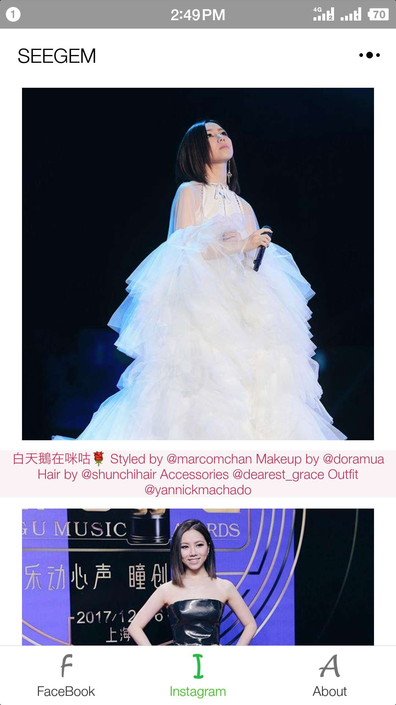
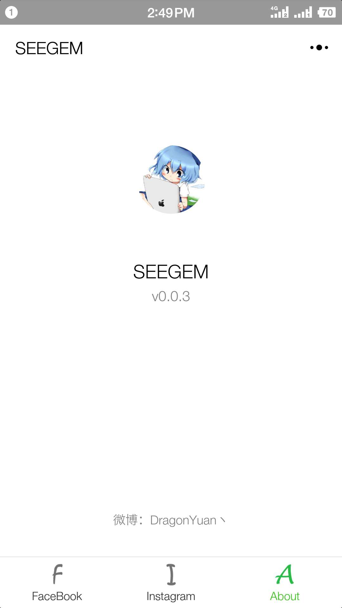

# SEEGEM
WeChat applet 'SEEGEM'.Welcome to subscribe !</br>
✈让无法科学上网的粉丝关注爱豆的脸书与照片墙动态

#### 关于项目：
```html
1.SEEGEM项目是我为了追偶像（G.E.M）开发的微信小程序，方便查看爱豆在FB和INS上的图文动态。
  之前的项目为Ins_fb_pictureSpider_WEB（可以参考之前的repositories），为了方便移植到了微信小程序上。
2.一些粉丝由于无法科学上网，所以通过此项目可以帮助了解资讯动态。
3.您可以换成所希望关注博主的FB和INS，具体请参考使用第四条。
```


#### 使用：
```html
1.resources文件夹:
    -> application.properties
        spring.datasource.username
        spring.datasource.password
        
    -> facebook4j.properties
        oauth.appId
        oauth.appSecret
        oauth.accessToken
        http.proxyHost
        http.proxyPort
        (此处注意，oauth为Facebook开发者验权信息，可在官方注册应用；proxy为服务器代理，项目并非黑科技，可自行使用SSR)
        
2.source.me.dragon.utils
    -> OSSUploadUtil.java
        (使用了阿里云OSS技术进行图片存储，配置application中的OSS参数即可)
        
3.source.me.dragon.schedule
    -> GemScheduler.java
        (此处用到了定时器，每隔一小时爬取新动态，开发环境为一分钟)
        
4.source.me.dragon.biz
    -> GemFacebookFeed
        (此处修改flushFacebook方法中的RawAPIResponse方法参数即可)
    -> GemInstagramFeed
        (此处修改flushInstagram方法中的Spider方法参数即可)
```

#### 关于代码：
1.项目开发于2017.12使用了[NovSpringBoot](https://github.com/dragon-yuan/NovSpringBoot) </br>
2.在项目中使用的OSS技术为阿里云提供文件存储服务，并通过CDN加速，提高访问速度


#### 项目展示：




#### 感谢：
1.[facebook4j](https://github.com/roundrop/facebook4j) </br>
    -> 感谢此项目，并使用到了项目中，很好的依赖 </br>
2.[instagram4j](https://github.com/lithiumtech/instagram4j) </br>
    -> 此项目无法使用代理，所以只能使用爬虫自行爬取 </br>
3.[weibo-spider](https://github.com/yuki-lau/weibo-spider) </br>
    -> 感谢此项目提供了学习的机会，但由于新浪微博API禁用，目前不适用由于新浪微博 </br>
4.感谢微信小程序前端技术 </br>